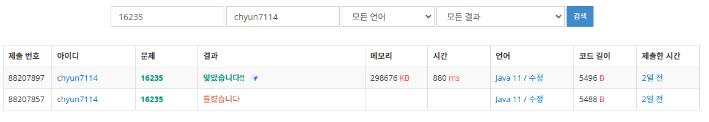

# [Gold III] 나무 재테크 - 16235

[문제 링크](https://www.acmicpc.net/problem/16235)

### 성능 요약

메모리: 298676 KB, 시간: 880 ms

### 분류

자료 구조, 구현, 시뮬레이션

### 제출 일자

2025년 1월 5일 15:21:18

### 풀이

1. 4계절이 지나야 1년이고, 1년 마다 카운트를 한다는 점에 유의하자
2. 그리고 시간이 0.3초이므로, 배열에 저장 후 조회하는 것보다, 리스트에 좌표 정보를 저장하는 것이 더 조회가 빠를 것이다.
3. 봄의 경우
    1. 나무를 저장한 리스트에서 양분을 먹게하는데 이때 양분을 먹지 못하는 나무는 즉시 죽이고 그 인덱스를 따로 덱에 저장한다
4. 여름의 경우
    1. 죽은 나무들의 인덱스를 덱에서 꺼내고, 죽은 나무들의 나이를 2로 나눈 값을 원래 나무가 있던 위치에 양분으로 추가한다
5. 가을의 경우
    1. 8방향을 생각하며, 새로운 나무 리스트를 만든다. 8방향의 좌표를 배열 범위 바깥으로 나가지 않도록 유의하면서 5의 배수의 나이가 된 나무들을 번식시킨다
    2. 그리고 이렇게 만들어진 나무들의 리스트를 원래 리스트와 교환한다.
6. 겨울의 경우
    1. 양분들을 주어진 입력값에 맞춰서 추가한다.
7. 이 과정을 반복하면 1년이 지나고, k년이 지난 후 살아있는 나무의 개수를 조회하여 출력하면 된다.

### 결과

후진시에는 방향을 바꾸지 않는다... 
후진시에는 방향을 바꾸지 않는다... 
후진시에는 방향을 바꾸지 않는다... 
후진시에는 방향을 바꾸지 않는다... 
후진시에는 방향을 바꾸지 않는다... 
이걸로 30분을 버렸습니다...
