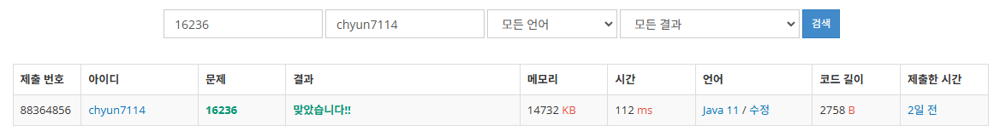

# [Gold III] 아기 상어 - 16236

[문제 링크](https://www.acmicpc.net/problem/16236)

### 성능 요약

메모리: 14732 KB, 시간: 112 ms

### 분류

너비 우선 탐색, 그래프 이론, 그래프 탐색, 구현, 시뮬레이션

### 제출 일자

2025년 1월 8일 18:16:42

### 풀이
### 풀이

1. 아기 상어의 현재 위치를 담는 클래스를 만든다.
    1. 이 클래스에는 아기 상어가 지금까지 어느정도의 거리를 움직였는지 알려준다.
2. 그 다음 아기상어의 위치들을 담는 우선순위 큐를 선언한다.
    1. 이 우선순위 큐는 거리가 가까운순으로, 거리가 가까우면 위에 있는 물고기 순으로, 위도 똑같으면 왼쪽에 있는 물고기 순으로 물고기를 먹게 해준다
3. 그 후 , BFS 탐색을 통해서 아기 상어가 다음에 어떤 물고기를 먹는지 정해준다
    1. 현재 아기 상어의 위치를 우선순위 큐에 담은 뒤, BFS 탐색을 진행한다.
    2. 탐색을 진행하다 물고기를 만나고, 이 물고기가 먹을 수 있는 물고기이면 그 좌표의 값을 0으로 만든 다음, 물고기를 먹은 후의 처리를 해준다.
    3. 그렇게 한 사이클을 돌리는 동안 물고기를 먹지 못한 경우, 탐색을 종료하고, 물고기를 먹은 경우 1초의 시간이 경과하게 한다
4. 탐색이 종료된 이후 경과 시간을 출력한다.

### 결과
