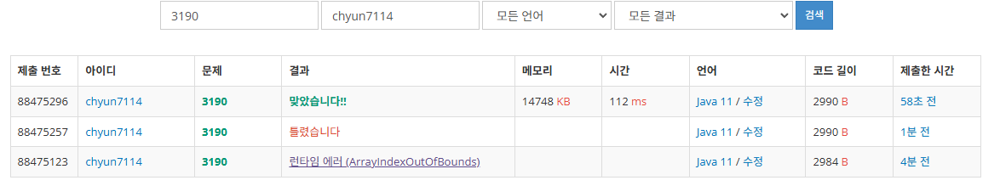

# [Gold IV] 뱀 - 3190

[문제 링크](https://www.acmicpc.net/problem/3190)

### 성능 요약

메모리: 14748 KB, 시간: 112 ms

### 분류

자료 구조, 덱, 구현, 큐, 시뮬레이션

### 제출 일자

2025년 1월 10일 23:40:31

### 풀이
1. 각 입력을 자료구조를 생각하여 받는다
    1. 여기서는 사과의 위치는 보드상에 1로 표현하고, direction정보는 map에 받아서 활용했다
2. 뱀의 위치를 설정하기 위해 queue를 설정한다.
    1. 만약 사과를 먹은 경우 queue에 현재 머리 위치를 추가하고
    2. 만약 사과를 먹지 않은 경우 queue에서 이전 머리 위치를 없애준다.
    3. 그리고 머리가 위치하고 있는 부분을 보드 상에서 2로 표현한다
3. 게임의 종료 조건을 설정한다
    1. 다음에 이동할 위치가 보드 바깥이면 게임을 종료시킨다
    2. 만약 다음에 이동할 위치의 값이 2라면(뱀의 몸통이 있는 경우) 게임을 종료한다.
4. map에서 time마다의 방향 전환 정보가 있는지 확인한다
    1. 만약 있다면 D, L이 들어올 때 마다 값을 다르게하여 dir값을 변환해준다.
5. 그리고 이 사이클을 반복하여 게임을 진행하고 게임 종료시 시간을 출력한다.

### 결과

문제좀 읽어봐요 시작점이 1,1이라고....