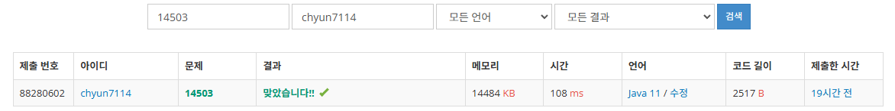

# [Gold V] 로봇 청소기 - 14503

[문제 링크](https://www.acmicpc.net/problem/14503)

### 성능 요약

메모리: 14484 KB, 시간: 108 ms

### 분류

구현, 시뮬레이션

### 제출 일자

2025년 1월 6일 23:44:54

### 풀이

1. 먼저 청소되지 않은 칸의 경우 칸의 값을 청소함으로 바꾼다(-1로 설정)
2. 그 후 상하좌우 4칸을 먼저 확인한다
    1. 만약 청소되지 않은 칸이 있는 경우
        1. 90도 회전 후 1칸 앞으로 이동한다
    2. 이 과정을 계속 반복해야하기 때문에 재귀함수로 식을 구성하고, return한다.
3. 그 다음 모두 청소가 완료되면
    1. 후진하기위해 180도 청소기를 돌려주고
    2. 후진을 시도하는데 만약 후진이 안되면 작동을 종료 후 카운트를 출력한다
    3. 단 후진시에는 방향을 바꾸지 않는다는 점을 명심한다.

### 결과
