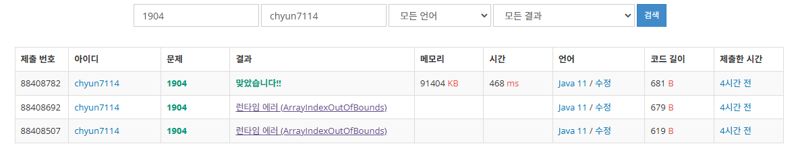

# [Silver III] 01타일 - 1904

[문제 링크](https://www.acmicpc.net/problem/1904)

### 성능 요약

메모리: 91404 KB, 시간: 468 ms

### 분류

다이나믹 프로그래밍

### 제출 일자

2025년 1월 9일 16:42:27

### 풀이

문제의 의도대로 배치한다

n  = 1 → 1

n = 2 → 00, 11

n = 3 → 100 001 111

n = 4 → 1001 0000 1111 1100 0011

…

계속 배치하면 피보나치 수열이라는 것을 알 수 있다.

### 결과

꼭 DP만하면 범위 지정 문제가 생기더라..