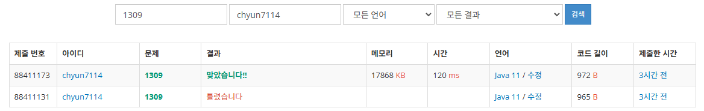

# [Silver I] 동물원 - 1309

[문제 링크](https://www.acmicpc.net/problem/1309)

### 문제 요약

다음과 같이 있는 우리에 가로 세로로 안겹치게 어떻게 사자를 배치하는지에 대해서 물어보는 문제이다

DP말고는 풀이방법이 안보이는 문제였다.

### 풀이

n이 늘어날 때마다 줄이 한 줄씩 늘어난다는 것을 사용하면 쉽게 해결할 수 있다.

아무것도 배치를 안한경우 → 0

왼쪽에 배치한 경우 → 1

오른쪽에 배치한 경우 → 2

이런식으로 생각후 n=1 … 이라고 생각후 2차원 DP테이블을 만든다

$$
dp[i][0] = dp[i - 1][0] + dp[i - 1][1] +dp[i - 1][2] 
$$

$$
dp[i][1] = dp[i - 1][0] + dp[i - 1][2] 
$$

$$
dp[i][2] = dp[i - 1][0] + dp[i - 1][1]
$$

이와 같은 방식으로 칸이 겹치지 않게 배치하면 된다.

그 후 dp[n]행의 합을 구하면 정답이다.

### 결과

DP를 할때 항상 조심해야하는 것은 문제의 조건을 잘 읽는 것인것 같다
