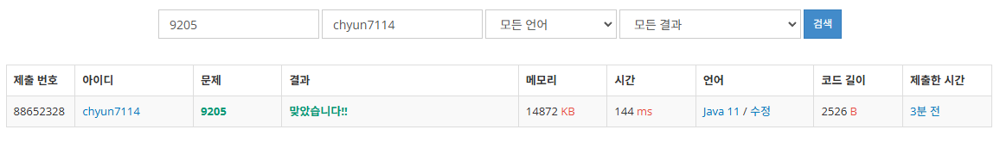

# [Gold V] 맥주 마시면서 걸어가기 - 9205

[문제 링크](https://www.acmicpc.net/problem/9205)

### 성능 요약

메모리: 14872 KB, 시간: 144 ms

### 분류

너비 우선 탐색, 그래프 이론, 그래프 탐색

### 제출 일자

2025년 1월 14일 21:31:27

### 풀이
1. 지점마다 도착을 하냐 못하냐를 물어보는 문제 → 그래프 탐색문제
    1. 인접 행렬 형식이 아닌 인접 리스트 형식으로 값을 받는다
2. BFS 탐색을 수행한다
    1. 만약 축제장에 갈 수 있다면
        1. happy출력 후 종료
    2. 만약 다음 편의점을 방문하지 않았고, 다음 편의점까지의 거리가 1000이하인 경우
        1. 큐에 다음 편의점 위치 담고 방문 처리
    3. 큐가 빌때까지 축제장에 도착하지 못했다면
        1. sad출력 후 종료
### 결과

인접 리스트로 표현되는 그래프도 연습해야겠다.