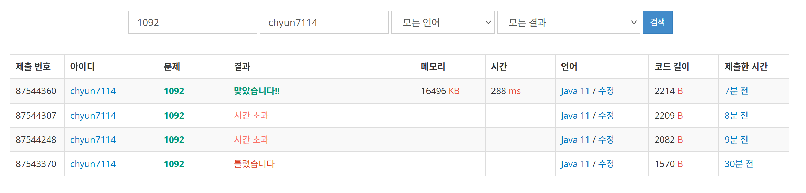

# [Gold V] 배 - 1092

[문제 링크](https://www.acmicpc.net/problem/1092)

### 성능 요약

메모리: 16496 KB, 시간: 288 ms

### 분류

그리디 알고리즘, 정렬

### 제출 일자

2024년 1월 23일 23:17:19

### 풀이

1. 먼저 크레인과 박스에 무게가 주어져 있고 크레인에는 무게 제한이 있다는 것을 생각함.
2. 그 후 배로 옮기는데 드는 시간의 최솟값을 구해야하기 때문에, 그리디 알고리즘을 생각함
    1. 가벼운 박스를 먼저 옮기는 것보다 무거운 박스를 먼저 옮기는 것이 문제 해결의 실마리라 생각함. 그러므로 각 정보를 받은 정렬을 내림차순 정렬을 해야한다 생각.
3. 제일 먼저 생각해야 할 것은 아무 박스도 옮기지 못하는 경우이다.
    1. 그러므로 가장 무거운 박스보다 크레인의 무게제한이 작은 경우 크레인이 옮기는 것을 수행하지 못함 그러므로 -1 리턴
    2. 이 체크후 루프를 돌면서 확인한다.
4. 박스를 모두 옮길 때까지 루프를 돌면서 확인한다.
    1. 만약 모든 짐을 다 실은 경우, 돌던 루프를 빠져나온다.
    2. 크레인과 박스 투 포인터를 활용하여 루프를 돌린다
        1. 만약 크레인에 박스를 실을 수 있는 경우(크레인의 무게 제한이 박스 무게보다 큰 경우) 크레인에 박스를 실는다. ⇒ 크레인의 인덱스를 늘리고 박스를 목록에서 제거
        2. 만약 반대의 경우 ⇒ 다음 박스를 탐색
5. 이 루프를 한번 돌 때마다, 결과값을 1씩 늘려서 답을 찾아낸다.

### 결과
