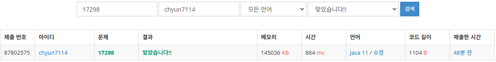

# [Gold IV] 오큰수 - 17298

[문제 링크](https://www.acmicpc.net/problem/17298)

### 성능 요약

메모리: 145036 KB, 시간: 864 ms

### 분류

자료 구조, 스택

### 제출 일자

2024년 2월 2일 23:55:41

### 풀이

1. 완전 탐색으로 문제 해결시 시간 초과가 난다 ⇒ 그러므로 fail.
2. 스택을 활용하여 문제를 풀어 나간다.
3. 스택에 자신의 오른쪽에 있는 가장 큰 수들의 집합을 만든다는 생각으로 index값을 집어 넣을 것이다
    1. 만약 스택이 비어있지 않고 arr[stack.peek()] >arr[index]인 경우 arr[index]  = arr[stack.pop()]으로 바꿔준다.
    2. 그리고 현재 index값을 스택에 넣어준다.
    3. 이렇게 스택에서 가장 먼저 나온 자기보다 큰 수가 자신의 오큰수가 될 것이다.
4. 그 후, 스택에 남아 있는 인덱스들은 오큰수를 찾지 못한 수들이다 이를 모두 -1로 바꾼 후 출력한다.

### 결과
