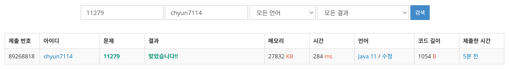

# [Silver II] 최대 힙 - 11279

[문제 링크](https://www.acmicpc.net/problem/11279)

### 성능 요약

메모리: 27832 KB, 시간: 284 ms

### 분류

자료 구조, 우선순위 큐

### 제출 일자

2025년 1월 28일 19:50:43

### 풀이

우선 순위 큐를 지지고 볶고 하는 문제이다. 
문제 조건대로 최대 힙을 사용해야하기 떄문에 일반적인 우선순위 큐와 반대로 큐를 생성해준다

그리고 0이 입력 될 때마다 출력을 하는 방식으로 알고리즘을 구성한다. 
대신 큐가 비어있는 경우의 예외처리를 해준다.

### 결과

