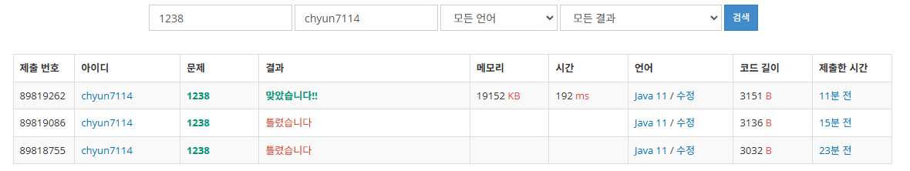

# [Gold III] 파티 - 1238

[문제 링크](https://www.acmicpc.net/problem/1238)

### 성능 요약

메모리: 19152 KB, 시간: 192 ms

### 분류

데이크스트라, 그래프 이론, 최단 경로

### 제출 일자

2025년 2월 9일 18:18:47

### 풀이

경로상 가중치 최소 거리를 구하는 문제이다 다잌스트라를 사용해서 푸는 문제이다.

그러나 이 문제는 단방향 그래프로 왕복을 하는 대신에 오는길 가는 길 경로가 다르다

그러므로 A → X → A로 돌아가는 다익스트라를 구하는 것인데 이를 두 과정으로 나누어서 구하는 것으로 했다.

A → X 다익스트라 1번 X → A 다익스트라 1번으로 총 2번의 다익스트라를 구현하고 구현 이후 가장 먼 거리의 이동거리를 가진 사람이 누군지 구하면 끝나는 문제이다.

### 결과
