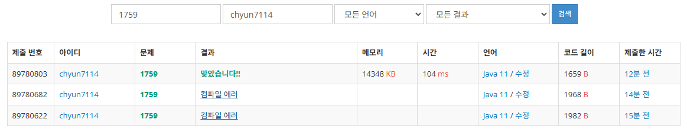

# [Gold V] 암호 만들기 - 1759

[문제 링크](https://www.acmicpc.net/problem/1759)

### 성능 요약

메모리: 14348 KB, 시간: 104 ms

### 분류

백트래킹, 브루트포스 알고리즘, 조합론, 수학

### 제출 일자

2025년 2월 8일 20:15:58

### 풀이

1. 모음 최소 1개 자음 2개를 만족시키는 방법을 찾는다.
    1. 메모리 부족을 방지하기 위해 전역변수로 code를 선언한다
    2. 모음 개수와 자음 개수를 검사하여 코드를 출력해도 되는지 파악한다.
2. code를 만든다.
    1. code는 l개의 글자가 들어가야하기 때문에 l개의 문자가 들어간 경우 모음, 자음 여부를 검사한다.
    2. 만약 글자 수가 부족한 경우, 다음 인덱스의 문자를 탐색하여 code를 사전 순으로 만들도록 한다.
    3. 이 과정을 계속 반복해야하기 때문에, 재귀함수로 이 과정을 반복할 수 있게 한다. 이 때 index가 l과 같아지면 재귀함수 종료 조건에 도달하도록 한다.

### 결과
