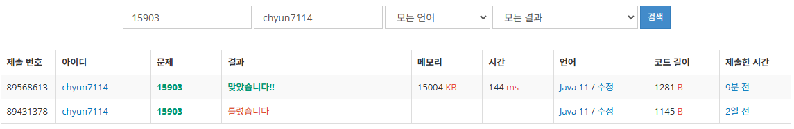

# [Silver I] 카드 합체 놀이 - 15903

[문제 링크](https://www.acmicpc.net/problem/15903)

### 성능 요약

메모리: 15004 KB, 시간: 144 ms

### 분류

자료 구조, 그리디 알고리즘, 우선순위 큐

### 제출 일자

2025년 2월 4일 23:12:13

### 풀이

1. 우선순위 큐를 사용한다. 모든 카드를 횟수에 맞춰 합쳐서 최소를 만들어야하기때문에 최소힙을 사용해서 문제를 푼다.
2. 최소 힙에 모든 숫자들을 집어넣는다. 이러면 현재 큐에는 작은 수부터 차례대로 나오게 된다
3. 힙에서 숫자를 빼내서 합체시킨다. 가장 작은 정수 2개를 빼내고 숫자를 합해준다
4. 합한 숫자를 다시 큐에 집어넣는다 → 2번 집어넣는다.
5. 그렇게 해서 완성된 큐의 모든 숫자들을 다 더해서 결과를 출력한다.

### 결과
