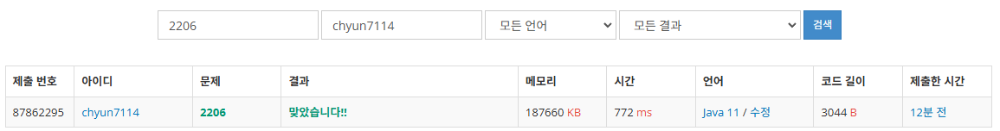

# [Gold III] 벽 부수고 이동하기 - 2206

[문제 링크](https://www.acmicpc.net/problem/2206)

### 성능 요약

메모리: 187660 KB, 시간: 772 ms

### 분류

너비 우선 탐색, 그래프 이론, 그래프 탐색

### 제출 일자

2025년 2월 16일 13:31:14

### 풀이
1. 일반적인 그래프 탐색을 하는 문제이다. 그러나 이 문제는 벽을 부수고 이동하느냐, 벽을 부수지 않고 이동하느냐 2개의 경우로 나눠서 생각해야한다
    1. 1번의 bfs 혹은 dfs 탐색시 필요한 visited 배열은 1개이지만, 이 문제에서는 2개의 visited배열이 필요했다. 그러므로 3차원 배열로 visited 배열을 선언하고, 0일때 벽을 부수지 않은것, 1일 때 벽을 부쉈다고 생각하고 문제를 푼다.
2. 그 후 bfs를 사용하여 문제를 푼다
    1. 먼저 다음 가는 곳이 벽인 경우
        1. 벽을 부수지 않았을 경우 visited[nx][ny][0]에 방문 처리 후 bfs
        2. 벽을 부순 경우 visited[nx][ny][1]에 방문 처리 후 bfs
    2. 다음 가는 곳이 벽인 경우
        1. 벽을 부수지 않은 경우만 visited[nx][ny][1]에 방문 처리 후 bfs
3. 이 과정을 다 거친경우 도착지에 도달한 경우 count값을 출력하고, 도달하지 못한 경우에 -1을 출력한다. 대신 따로 최단 거리를 판별할 필요는 없다.

### 결과
