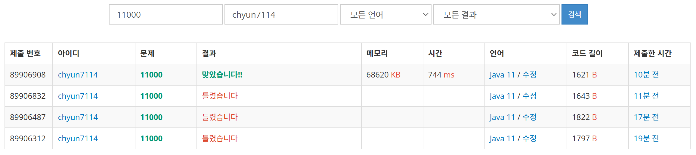

# [Gold V] 강의실 배정 - 11000

[문제 링크](https://www.acmicpc.net/problem/11000)

### 성능 요약

메모리: 68620 KB, 시간: 744 ms

### 분류

자료 구조, 그리디 알고리즘, 우선순위 큐, 정렬

### 제출 일자

2025년 2월 11일 14:36:14

### 풀이

그리디 알고리즘을 사용해서 모든 수업을 할 수 있게 만드는 문제이다

1. 시간 순으로 각 시간을 정렬한다. 이 때 시작 시간을 기준으로 정렬하고, 만약 시작 시간이 같은 경우에는 끝나는 시간을 오름차순 정렬한다.
2. 그 다음 우선순위 큐에 끝나는 시간을 체크한다.
3. 우선순위 큐 내부의 끝나는 시간을 체크 하면서 모든 강의 테이블을 순회한다. 이 때 우선순위 큐 내의 가장 빨리 끝나는 시간보다 강의시작이 늦는다면 우선순위 큐의 내용을 하나 poll하고 새로운 강의 시간으로 업데이트 한다.
4. 그 후 마지막으로 남은 우선순위 큐 내의 원소들이 현재 필요한 강의실 개수이다. 우선순위 큐의 사이즈를 출력하여 문제를 해셜한다.

### 결과

질문 게시판을 살펴보니 힙 인덱스 관련해서 틀린것이 이유라고한다
이 내용은 나중에 조금 더 찾아보도록 해야겠다는 생각이 들었다.