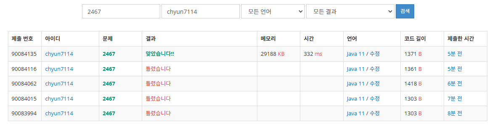

# [Gold V] 용액 - 2467

[문제 링크](https://www.acmicpc.net/problem/2467)

### 성능 요약

메모리: 29188 KB, 시간: 332 ms

### 분류

이분 탐색, 두 포인터

### 제출 일자

2025년 2월 14일 23:18:04

### 풀이

간단하게 투 포인터로 구현 가능한 문제이다

1. 투 포인터를 선언한다
2. 포인터가 위치한 원소를 더한다
    1. 이 때 가장 최소의 값이 나온다면 최소값을 업데이트, 최소의 인덱스도 업데이트한다
    2. 그리고 더한 값이 0보다 크면 right를 줄이고, 0보다 크면 left를 늘린다.
3. 마지막으로 최소 인덱스에 위치한 원소를 출력한다.

### 결과

뇌를 빼고 풀어서 출력을 잘못 넣은.....