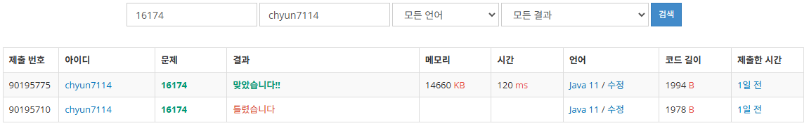

# [Silver I] 점프왕 쩰리 (Large) - 16174

[문제 링크](https://www.acmicpc.net/problem/16174)

### 성능 요약

메모리: 14660 KB, 시간: 120 ms

### 분류

너비 우선 탐색, 깊이 우선 탐색, 다이나믹 프로그래밍, 그래프 이론, 그래프 탐색

### 제출 일자

2025년 2월 17일 17:54:47

### 풀이

간단히 BFS를 구현해주면 되는 문제였다.

대신 BFS의 종료조건을 밟은 칸의 거리 정보를 파악하고 칸을 넘지 않는지 검사하는 것이 중요하다

### 결과
