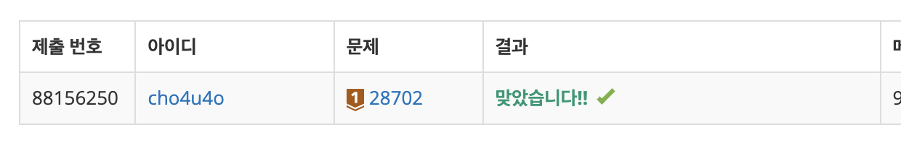

`25/01/04`

## 28702: FizzBuzz

해당 문제는 각각 연속된 숫자가 대입될 수 있는 연속된 문자열을 넣고, 이를 바탕으로 다음에 올 숫자를 추론하여, 이 숫자가 해당하는 문자열을 출력하는 문제입니다.

- i가 3의 배수이면서 5의 배수이면 “FizzBuzz”를 출력합니다.
- i가 3의 배수이지만 5의 배수가 아니면 “Fizz”를 출력합니다.
- i가 3의 배수가 아니지만 5의 배수이면 “Buzz”를 출력합니다.
- i가 3의 배수도 아니고 5의 배수도 아닌 경우 i를 그대로 출력합니다.

### 예시

1 
2 
Fizz 
뒤에는 4가 옵니다. 이때 Fizz는 3을 의미합니다.
4는 3의 배수도 아니고 5의 배수도 아니므로 그대로 출력됩니다.
따라서 예상 출력은 4가 됩니다.

## 풀이

이 문제를 풀 때 가장 중요한 것은 문자열이 대입되는 숫자를 찾는 것입니다. 
따라서 입력에 숫자가 있는 경우와 없는 경우를 우선으로 나눕니다. 
입력에 숫자가 있는 경우, 출력될 숫자를 알아내고 숫자가 어느 경우에 해당하는지 판단합니다. 
그런데 생각하다 보니 모든 입력에 숫자가 존재하기 때문에, 일단 숫자가 있다고 가정하고 풀이했습니다.

1. 일단 입력을 받고, 숫자의 경우 숫자로 바꿔줍니다.
2. 숫자를 바탕으로 다음 숫자를 추측합니다.
3. 다음 숫자가 어떤 문자열인지 확인합니다.
4. 정답을 출력합니다.

## 해결

첫 자바스크립트 문제 풀이라 해결 시간은 측정하지 않았습니다. 
다음 풀이부터 측정해 보도록 하겠습니다.
