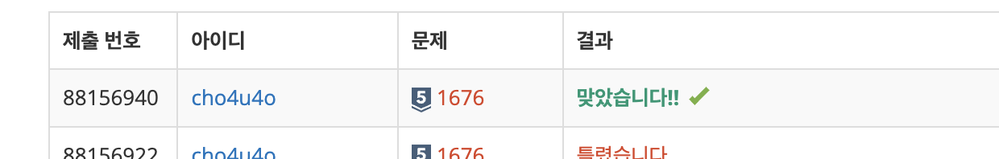

`25/01/04`

## 1676: 팩토리얼 0의 개수

해당 문제는 N!에서 뒤에서부터 처음 0이 아닌 숫자가 나올 때까지 0의 개수를 구하는 문제입니다.

## 풀이

뭐지.. 실버 5치고 매우 쉽다고 생각했습니다 
그냥 팩토리얼을 구하고, 뒤에서부터 0이 아닌 숫자가 나올 때까지 0의 개수를 구합니다. 
근데 비밀이 있었습니다. 큰 숫자가 되면 e+25와 같은 방식으로 숫자가 나와서, 정상적으로 값을 구할 수 없었습니다. 
그래서 생각을 해 보다가 규칙이 있을 것 같아서 기존 로직을 통해 계속 팩토리얼을 구해보았고 
n에서 5를 나눈 수만큼 0이 들어간다는것을 확인하게 되었습니다. 
5를 나눈 값을 출력해줘 보겠습니다. 
에잉.. 근데 26부터는 규칙이 맞지 않았습니다. 
결국 10의 배수를 찾아야 합니다. 5룰 나눈 수만큼 0이 나왔던 이유는 10이 5와 2의 배수이기 때문이었고.. 
25부터 안 됐던 이유는 25는 5x5x2였기 때문입니다.

## 해결

삽질 너무 했네요..

현타 옵니다

5 배수 구하는 과정도 계속 삽질했네요.. 내일은 더 나은 모습 보일 수 있길.. 어려운 문제도 아니었는데....
