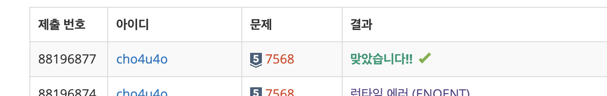

`25/01/05`

## 7568: 덩치

두 사람 A 와 B의 덩치가 각각 (x, y), (p, q)라고 할 때 x > p 그리고 y > q 이라면 우리는 A의 덩치가 B의 덩치보다 "더 크다"고 말합니다. 
어떤 A, B 두 사람의 덩치가 각각 (56, 177), (45, 165) 라고 한다면 A의 덩치가 B보다 큰 셈이 됩니다. 
두 사람 C와 D의 덩치가 각각 (45, 181), (55, 173)이라면 몸무게는 D가 C보다 더 무겁고, 키는 C가 더 크므로, "덩치"로만 볼 때 C와 D는 누구도 상대방보다 더 크다고 말할 수 없습니다. 
이를 고려하여 자신보다 덩치가 큰 사람의 수 + 1을 덩치 등수라고 합니다.

입력받은 n명의 덩치 등수를 순서대로 출력하는 문제입니다.

## 풀이

- 일단 명수 입력을 받고 입력을 저장합니다
- 두 수가 모두 더 큰 경우만 덩치가 큰 경우입니다
- 두 수를 비교하는 함수를 구현합니다
- 두 수를 비교하는 함수를 이용해 랭킹을 구하고 랭킹 배열을 리턴하는 함수를 구현합니다
- 포맷에 맞게 출력

## 해결

한 30분 정도 걸렸습니다 
역시 실5라 어려운 문제는 아니었다 

