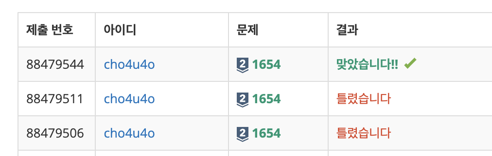

`25/01/10`

## 1654: 랜선 자르기

실버2라니.. 어려울까봐 걱정이 많이 되네요 
첫째 줄에는 K, N이 입력됩니다. 
여기서 K는 아래에 주어질 수들의 개수이고, N은 아래에 주어진 수에서 동일한 길이로 잘라내 만들어야 하는 수의 개수입니다 
이게 무슨 말이냐면..

### 입력 예시

4 11 
802 
743 
457 
539 
이렇게 입력이 주어지면, 이 4개의 수에서 총 11개의 동일한 크기의 조각을 만드는데, 이때 최대 조각의 크기를 구하게 되는 것입니다. 
이때 정답은 200인데, 802cm 랜선에서 4개, 743cm 랜선에서 3개, 457cm 랜선에서 2개, 539cm 랜선에서 2개를 잘라내 모두 11개를 만들 수 있습니다. 
아 근데 딱 N개를 만드는 게 아니라 N개 이상을 만들어도 최대 길이면 된다는 조건이 있었습니다 ㅠ

## 풀이

- 처음에는 그냥 일일이 빼주면서 조건 만족하도록 해쓴데 무조건 시간 초과가 날 것 같아서 방법을 바꿨습니다.
- 최대 조각의 크기를 탐색하는 것이기 때문에 이진 탐색을 사용하는 것이 시간과 메모리 면에서 좋을 것이라고 생각했습니다 (알고리즘의 시간과 메모리에 대해서도 추가 공부 필요)
- 해결은 Max값 기준으로 이진탐색하여 조각값을 계속 업데이트하고 이걸 주어진 N개에 수에서 나누고 나눈 결과를 더해서 이 값이 K값, 즉 dest값보다 크거나 같은지 여부를 확인하고, 만약 dest값보다 작다면 조각의 크기를 줄이고(right값을 mid - 1로), dest값보다 크거나 같다면 더 큰 크기도 가능한지 알기 위해 조각의 크기를 늘렸습니다(result에 저장한뒤 left값을 mid + 1로)

## 해결

35분 정도 걸림. 이진 탐색에 대해 더 알아가는 시간을 가지면서 열심히 검색하면서 풀었는데 결론적으로는 문제 제대로 안 읽어서 좀 오래 걸렸네요

