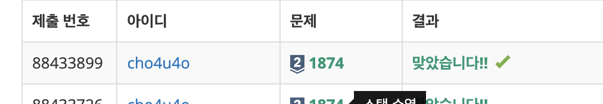

`25/01/10`

## 1874: 스택 수열

1부터 n까지의 수를 스택에 넣었다가 뽑아 늘어놓음으로써, 스택 수열을 만들 수 있습니다. 
이때, 스택에 push하는 순서는 반드시 오름차순을 지키도록 한다고 가정합니다.  임의의 수열이 주어졌을 때 스택을 이용해 그 수열을 만들 수 있는지 없는지, 있다면 어떤 순서로 push와 pop 연산을 수행해야 하는지를 알아내는 문제입니다.

처음엔 이해가 안됐는데 입력을 받을때 처음은 N개의 n이 주어지고 나머지줄은 우리가 완성해야 하는 수열이 주어지는 겁니다. 
그래서 1부터 N까지 오름차순으로 정렬된 배열에서 stack에 어떻게 push하고 pop해야 완성해야 하는 수열이 완성되는지에 관한 문제입니다. push와 pop을 통해 주어진 배열을 완성할 수 없다면 NO를 출력해야 합니다.

## 풀이

- 처음에 숫자로 된 배열을 만든 다음에 그냥 무턱대고 shift하고 push를 했었는데. 이게 답은 맞았지만 메모리 초과가 났어요
- 그래서 진짜 멍청하게도 삽질을 계속 했습니다..
- 그러다가 지피티를 한번 돌렸는데 그냥 초기값을 1로 하고 목표수 만족할때까지 더해주며 push하고 그다음에 pop했는데 값이다르면 안되는거.. 그리고 아니면 그냥 -를 추가한뒤 다음 목표배열 값 처리하고....
- while current <= dest[i] 로 해서 current가 dest보다 클때는 stack.pop 후 그냥 -로 넘기고 다음 값 처리하고.. 진짜 처음에 결과만 맞었던 코드에서 크게 다를 건 없었는데, 생각의 변화가 없었던 것 같아요.
- 더군다나 shift가 계속 요소 인덱스를 옮겨주어야해서, 그리고 숫자로 된 배열을 만드는 과정에서 메모리를 많이 차지해서 메모리 초과가 났다는 점도 알게 되었습니다.
- 배열 다루는 데 더 익숙해지면 좋을 것 같아요

## 해결

중간에 삽질해서 진짜 오래 걸렸는데 무튼 해결

