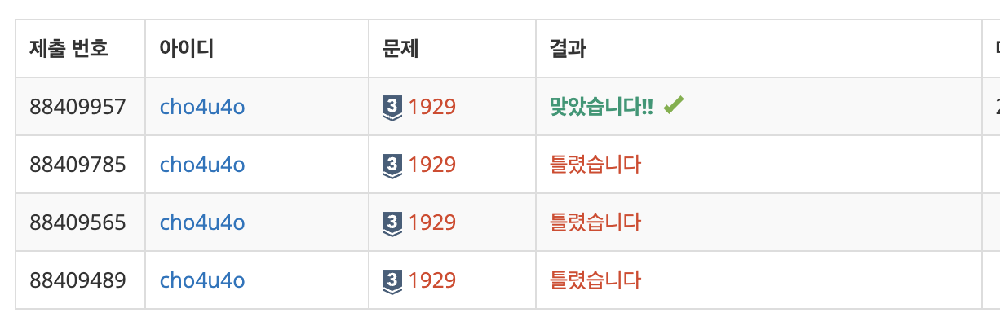

`25/01/09`

## 1929: 소수 구하기

간단한 문제네요. M이상 N이하의 소수를 모두 출력하는 문제입니다. 
첫째 줄에 자연수 M과 N이 빈 칸을 사이에 두고 주어지고, (1 ≤ M ≤ N ≤ 1,000,000) M이상 N이하의 소수가 하나 이상 있는 입력만 주어진다고 합니다.

한 줄에 하나씩, 증가하는 순서대로 소수를 출력하면 됩니다.

## 풀이

- 문제가 간단해서 매우 좋은데, 소수 판별은 예로부터 엄청 애먹던 주제입니다.
- 시간적 효율도 따져야 하고.. 근데 과거에 에라토스테네스의 체 방식을 사용했던 기억이 납니다.
- 에라토스테네스의 체는, 그냥 해당하지 않으면 지워주면 됩니다.
- 따라서 해당범위 길이의 배열, true로 초기화된 배열을 생성해줍니다.
- 선택한 숫자의 배수를 모두 지워주면 되는데요.
- 2부터 선택하고, 남아있는 수 중 가장 작은 수를 선택해주고 이 과정을 선택된 숫자가 루트N보다 작을 때까지 반복해주면 됩니다.
- 우리는 M이상 N이하니까, 일단 N+1길이의 배열을 만들어주고, 값이 true인 인덱스의 배열을 만들어준뒤 M이상으로 slice해주면 되겠네요.

## 해결

시간은 20분 정도 걸렸습니다. 
88%에서 자꾸 틀리길래 질문 게시판을 살펴봤더니 1을 소수로 포함시켜서였습니다. 
수정 후 정답이 되었습니다. 앞으로 문제를 더 잘 읽어야겠네요
