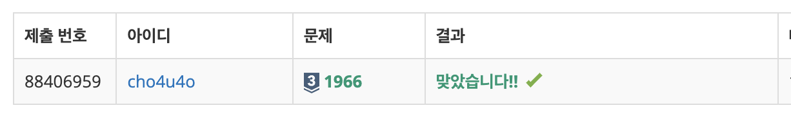

`25/01/09`

## 1966: 프린터 큐

현재 Queue의 가장 앞에 있는 문서의 ‘중요도’를 확인합니다. 
나머지 문서들 중 현재 문서보다 중요도가 높은 문서가 하나라도 있다면, 이 문서를 인쇄하지 않고 Queue의 가장 뒤에 재배치하며, 그렇지 않다면 바로 인쇄합니다. 
예를 들어 Queue에 4개의 문서(A B C D)가 있고, 중요도가 2 1 4 3 이라면  C를 인쇄하고, 다음으로 D를 인쇄하고 A, B를 인쇄하게 됩니다.

현재 Queue에 있는 문서의 수와 중요도가 주어졌을 때, 어떤 한 문서가 몇 번째로 인쇄되는지 알아내는 문제입니다. 
예를 들어 위의 예에서 C문서는 1번째로, A문서는 3번째로 인쇄되게 됩니다.

### 입력 예시와 설명

3 
1 0 
5 
4 2 
1 2 3 4 
6 0 
1 1 9 1 1 1

이렇게 입력이 주어지면 맨 위 3은 테스트 케이스의 개수이고 
1 0, 4 2, 6 0은 각각의 테스트케이스입니다. 
그리고 테스트케이스에서 [0]에 해당하는 수는, 큐에 들어간 숫자들의 개수이고 
[1]에 해당하는 수는 몇 번째로 인쇄되는지 궁금한 수의 인덱스입니다. 
그리고 각각 테스트케이스 아래에 있는 수열은 큐에 들어가 있는 수입니다.

## 풀이

- 일단 여느때와 같이 입출력을 처리하고, 나머지 문서들 중 현재 문서보다 큰 수가 있다면 가장 뒤에 재배치하는 함수를 구현합니다.
- 그리고 한 테스트케이스 당 큐가 빌 때까지 위에서 구현한 함수를 가동하면 될 것 같습니다.
- 큐에서 마지막(맨앞? 가장 먼저들어온요소, 곧 나갈요소)에 있는 요소에게, 프린트될 수 있는지 여부를 확인하는 함수를 가동합니다. 이 함수는 해당 요소의 뒤에 해당 요소보다 큰 수가 있는지 검사하고, `boolean`으로 결과를 반환해줍니다.
- 그럼 이 함수를 맨 마지막 요소를 대상으로 구동하고,
- 근데 추적을 원하는 요소가 몇번째로 나가는지는 어떻게 추적할까요?
- 일단 요소의 인덱스를 추적합니다. 절대 값으로 추적하면 안된다고 봅니다(같은값이 존재할수도 있으니)
- 그리고 요소의 인덱스가 마지막일때 프린트여부가 true면 카운트를 멈추고 아니면 걍 계속 돌리면 되는 거 아닌가요???

## 해결

결론부터 말하자면 한시간 정도 걸렸는데, 큐에 대한 미숙한 이해가 원인이었습니다.. 
0번인덱스를 내보내고 뒤에다 추가해야하는데, 맨뒤인덱스를 내보내고 처음에 추가했네요 ㅠㅠ
`push`도 뒤쪽에서, `pop`도 뒤쪽에서 이루어진다는걸... 간과? 했네요.. 
JavaScript에는 파이썬과 다르게 앞의 요소를 `pop`하는 `shift`라는 메서드가 있어서, 
이 사실을 알게 된 후에는 더 편하게 풀었던 것 같습니다. 
또한 `Math.max`메서드를 통해서 손쉽게 배열 안에 이 값보다 큰 값이 있는지 파악도 가능했네요.
 인덱스를 값으로 치환하지 않고, 값이 나가면 카운트를 올리고 인덱스값도 조정해주며 특정값을 추적함으로써 해결할 수 있었습니다.
 복잡하게 푼 것 같기도 하네요. 그치만 저는 개인적으로 `class`로 입력 정리하는 것이 좋아서 계속 사용하게 되네요.
