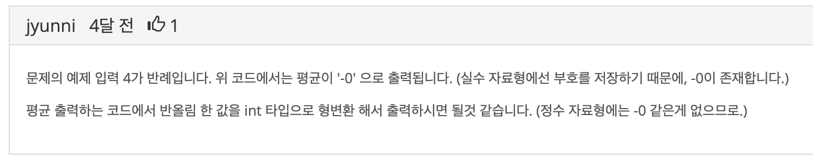
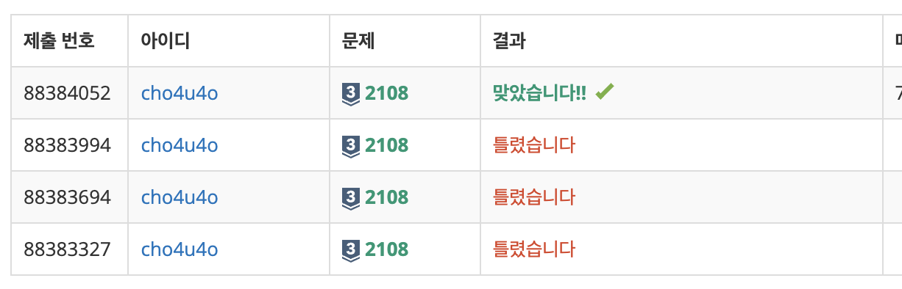

`25/01/08`

## 2108: 통계학

- 산술평균 : N개의 수들의 합을 N으로 나눈 값
- 중앙값 : N개의 수들을 증가하는 순서로 나열했을 경우 그 중앙에 위치하는 값
- 최빈값 : N개의 수들 중 가장 많이 나타나는 값
- 범위 : N개의 수들 중 최댓값과 최솟값의 차이

N개의 수가 주어졌을 때, 네 가지 기본 통계값을 출력합니다. 
이때 N은 무조건 홀수입니다.

출력시 주의사항은 다음과 같은데,

- 첫째 줄에는 산술평균을 출력하되 소수점 이하 첫째 자리에서 반올림한 값을 출력합니다.
- 둘째 줄에는 중앙값을 출력하면 됩니다.
- 셋째 줄에는 최빈값을 출력하는데, 여러 개 있을 때에는 최빈값 중 두 번째로 작은 값을 출력합니다.
- 넷째 줄에는 범위를 출력한다.

## 풀이

풀이는 간단합니다. 입력 처리 후 네가지 값을 반환하는 함수를 만들어준 뒤 값을 출력해주면 됩니다.

## 해결

정말 간단했어서 최빈값에서 Map 사용하는 부분만 좀 깨달음이 있었습니다. 
그리고 다 했는데 자꾸 84%에서 멈춰서 질문 게시판을 찾아보자 저랑 같은 경우가 있었습니다. 

평균이 -0으로 출력되고 있어서 84%에서 멈추는 것임을 알게 되었습니다. 
평균 구하는 함수 내부에서, sum 함수 동작 과정에서 합이 실수가 되어 평균 구할 때 실수 자료형의 부호가 남아있었던 것으로 추정됩니다. 
그래서 `parseInt`를 통해 int형으로 변환해주자 문제를 해결할 수 있었습니다. 
오늘은 Map의 사용과 Map의 데이터 접근 그리고 실수 자료형은 부호를 저장한다는 점을 알게 되었습니다.

