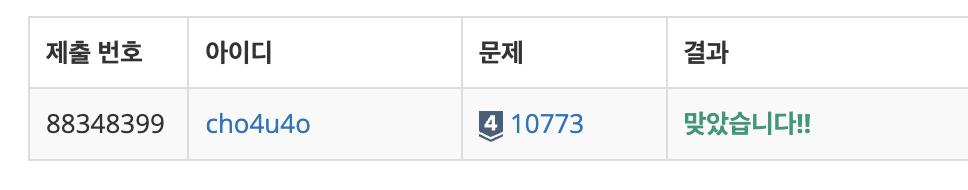

`25/01/08`

## 10773: 제로

첫 번째 줄에 정수 K가 주어지고, 이후 K개의 줄에 정수가 1개씩 주어집니다. 
0이 나올 때마다 이전 수를 지우고, 지우는 과정이 모두 완료된 뒤 남아있는 수들의 합을 출력하는 문제입니다.

## 풀이

- 입력을 처리하여 값들을 분리합니다
- 0이 나올때마다 이전 수를 pop하여 최종적으로 합을 구할 수들만을 반환하는 함수를 구현합니다
- 합을 구하는 함수를 구현합니다

## 해결

야호!!! 15분컷 원큐!!

