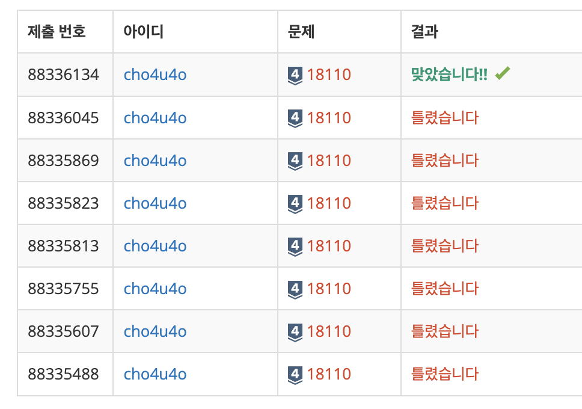

`25/01/08`

## 18110: solved.ac

난이도 결정 방식에 따라 결정된 문제의 난이도를 구하는 문제입니다.

### 1. 난이도 결정 방식

- 의견이 없으면 문제의 난이도는 0으로 결정합니다
- 의견이 하나 이상 있으면, 문제의 난이도는 모든 의견의 30% 절사평균으로 계산합니다

### 2. 절사평균 계산 방식

- 의견 수의 상위 15%와 하위 15%를 각각 제외합니다
- 제외할 사람의 수는 반올림하여 결정합니다
- 나머지 의견으로 평균을 계산하면 됩니다

### 3. 최종 난이도 결정

- 계산된 평균을 정수로 반올림하여 최종 난이도를 결정합니다

## 풀이

- 입력을 처리하여 N을 분리합니다
- `Math.round()`를 사용하여 반올림 15%값을 구하고, 제외할 인원을 파악합니다.
- 입력에서 받은 사람들이 준 N개의 점수를 정렬한 뒤 위와 아래에서 각각 제외합니다. (`slice` 메서드 이용)
- 제외된 배열에서 평균을 구해줍니다.

## 해결

이번에도 삽질을 많이 했네요. 
N이 1개일 때 제외할 인원은 0인데 `slice`가 (0, -0)으로 분리하다 보니 빈 배열이 되어버려서 계속 틀렸었네요. 
제외할 인원이 0이면 입력에서 받은 사람들의 점수 배열을 그대로 평균 구하는 함수로 넘겨주는 방법으로 개선했습니다. 
`reduce`메서드를 사용해서 총합 구하는 방법을 알게 되었고, `sort`도 또 제대로 사용해봤습니다.

