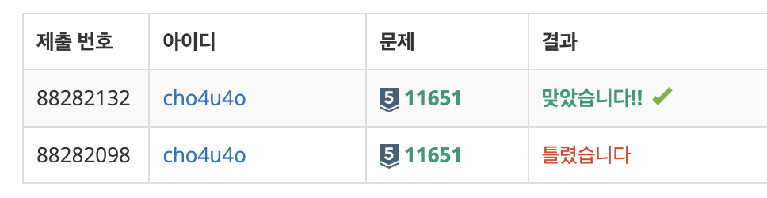

`25/01/06`

## 11651: 좌표 정렬하기 2

2차원 평면 위의 점 N개가 주어집니다. 좌표를 y좌표가 증가하는 순으로, y좌표가 같으면 x좌표가 증가하는 순서로 정렬한 다음 출력하는 프로그램을 작성하시오.

첫째 줄에 점의 개수 N (1 ≤ N ≤ 100,000)이 주어지고, 둘째 줄부터 N개의 줄에는 i번점의 위치 xi와 yi가 주어집니다. 
(-100,000 ≤ xi, yi ≤ 100,000) 좌표는 항상 정수이고, 위치가 같은 두 점은 없습니다. 
첫째 줄부터 N개의 줄에 점을 정렬한 결과를 출력합니다.

## 풀이

- 일단 입력을 받고, N을 분리합니다.
- Point 클래스를 생성하고 데이터를 Point 객체로 만듭니다
- Point 클래스를 비교하는 메서드를 만듭니다.
- 비교를 진행하고 정렬을 진행해야 합니다.
- sort 메서드를 좀 사용해볼 수 없을까 하던 중!
- sort 메서드 매개변수로 0, -1, 1을 리턴하는 함수를 통해 요소들을 특정 기준에 따라 정렬할 수 있다는 것을 알게 되었습니다..
- 매개변수로 남겨준 함수는 해결 코드에서 `isBigger`함수로, y값을 먼저 비교하고 두 값을 뺀 값을 리턴합니다.
- 두 값을 빼는 이유는, 뺀 값이 음수일 때(b가 a보다 클 때)는 a가 b보다 앞에 오도록 sort 메서드가 작동하기 때문입니다.

## 해결

20분 정도 걸렸습니다! 
sort 메서드 최고~ 
음수일 때에는 a가 앞, 양수일 때에는 a가 뒤, 0일 때에는 순서 변경 없다는 사실 기억하기..

