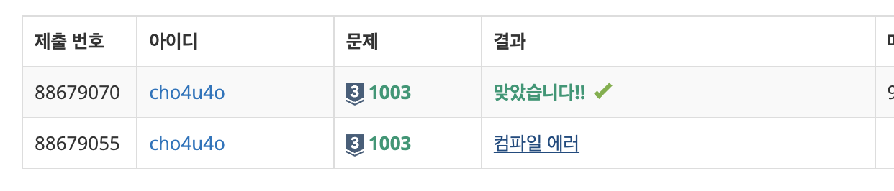

`25/01/15`

## 1003: 피보나치 함수

다음은 fibonacci(N) 함수입니다.

```C++
int fibonacci(int n) {
    if (n == 0) {
        printf("0");
        return 0;
    } else if (n == 1) {
        printf("1");
        return 1;
    } else {
        return fibonacci(n‐1) + fibonacci(n‐2);
    }
}
```

fibonacci(N)을 호출했을 때, 0과 1이 각각 몇 번 출력되는지 구하는 프로그램을 작성해야 합니다.<br>
첫번째 줄에는 테스트케이스(N)의 개수 T가 주어지고, 그다음 T개 줄에 테스트케이스가 주어집니다<br>
그리고 출력할 때에는 T개 줄에 각 테스트케이스에서 0이 출력되는 개수와 1이 출력되는 개수를 공백으로 구분해 출력하면 됩니다.

N = 5이면<br>

1. fibo(3), fibo(4) 호출

- fibo(3) => fibo(2), fibo(1) 호출 => fibo(1)에서 1출력
- fibo(2) => fibo(1), fibo(0) 호출 => fibo(1), fibo(0)에서 1, 0출력
- fibo(4) => fibo(3), fibo(2) => 위에서 fibo(3)은 1 2개, 0 1개이고 fibo(2)는 1 1개, 0 1개 => 1 3개, 0 2개

2. 1 4개, 0 3개 출력됨.

## 풀이

- 위에서 직접 계산하며, fibo(2)나 fibo(3), 즉 작은 값이 계속 사용된다는 점을 알 수 있는데요
- 동적 프로그래밍(DP)에서는 이렇게 큰 문제를 작은 문제로 쪼개서 계산하되 이 계산된 값을 저장하여 나중에도 쓸 수 있도록 하여 시간 복잡도를 줄이게 됩니다.
- 결국 아래에서 위로 올라가며 값을 저장해 놓는다면, 이 문제에서 원하는 답에 도달할 때에도 해당 값을 사용해 놓으면 되겠죠?
- 이를 바탕으로 설계해 보겠습니다

## 해결

해결하는 데 많이 도움이 된 [포스팅](https://eunjk.tistory.com/6)입니다.<br>
작은 문제로 쪼개서 계산하고 상위문제에서 작은문제의 답을 사용해 결과를 도출하는 DP의 개념이 잘 이해되었던 것 같습니다.<br>
논외적으로 저는 자바스크립트로 클래스객체 만드는게 너무 좋네용.. ㅋㅋ

아래는 C언어로 모르고 제출해서.. 나름 원큐
