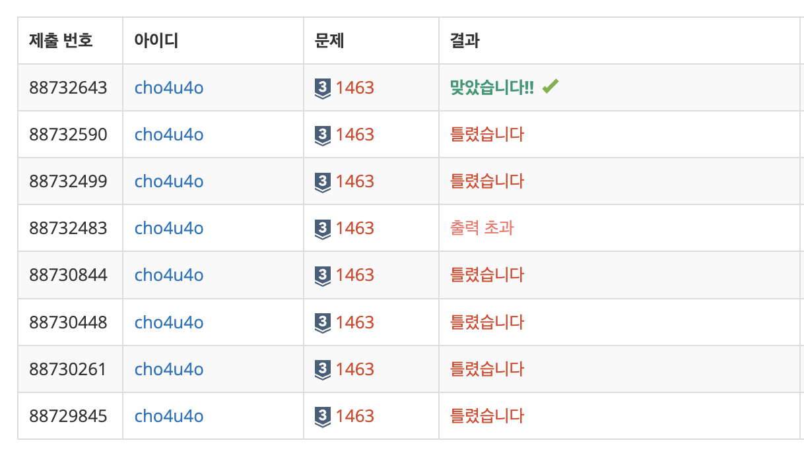

`25/01/16`

## 1463: 1로 만들기

정수 X에 사용할 수 있는 연산은 다음 세 가지.

- X가 3으로 나누어 떨어지면, 3으로 나눈다.
- X가 2로 나누어 떨어지면, 2로 나눈다.
- 1을 뺀다.

정수 N이 주어졌을 때, 위와 같은 연산 세 개를 적절히 사용해서 1을 만듭니다. 이때 연산을 사용하는 횟수의 최솟값을 출력하는 문제입니다.

첫째 줄에 1보다 크거나 같고, 10^6보다 작거나 같은 정수 N이 주어지고, 연산 횟수의 최솟값을 출력하면 됩니다.

## 풀이

12:02 시작

- 이 문제는 시간 제한이 엄청 빡셉니다. 0.15초죠
- 1초에 계산할 수 있는 횟수는 약 1억번이라고 합니다
- 현재 최댓값은 100만이고, 0.15초 이므로 딱 한번만 돌아야겠습니다(반복문 사용시) 다만 그 내부에서 10번 이내로 반복문 도는 건 괜찮아 보이긴 합니다. (1000만까지 이므로)
- 최대한 3으로 나누는 게 좋은 방법이라고 생각됩니다.
- 뭔가 DP를 사용할 수 있을 것 같기도 합니다. 하위 수에서 가장 적은 연산 수를 저장해 놓은 뒤, 상위 수에서 연산 횟수를 구하고 하위 수 연산 횟수를 더하면 될 것 같습니다.
- 그럼 이제 연산횟수를 어떻게 계산할 것인가가 문제입니다. 1을 빼고 3의 배수가 되는지 판별하기?
- 조건문을 통해서 가능한 값중 가장 최솟값을 취할 수 있도록 해줬습니다.

## 해결

1을 1번으로 해놔서 99%에서 계속 틀렸음요 ㅠㅠ

