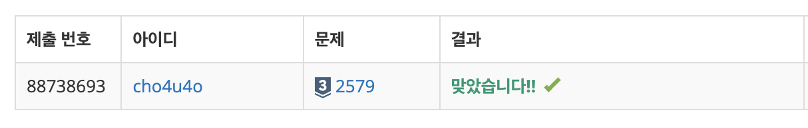

`25/01/16`

## 2579: 계단 오르기

```
계단은 한 번에 한 계단씩 또는 두 계단씩 오를 수 있다.
즉, 한 계단을 밟으면서 이어서 다음 계단이나, 다음 다음 계단으로 오를 수 있다.

연속된 세 개의 계단을 모두 밟아서는 안 된다. 단, 시작점은 계단에 포함되지 않는다.

마지막 도착 계단은 반드시 밟아야 한다.

각 계단에 쓰여 있는 점수가 주어질 때 이 게임에서 얻을 수 있는 총 점수의 최댓값을 구하는 프로그램을 작성하시오.
```

입력의 첫째 줄에 계단의 개수가 주어지고,

둘째 줄부터 한 줄에 하나씩 제일 아래에 놓인 계단부터 순서대로 각 계단에 쓰여 있는 점수가 주어집니다. 계단의 개수는 300이하의 자연수이고, 계단에 쓰여 있는 점수는 10,000이하의 자연수입니다.

계단 오르기 게임에서 얻을 수 있는 총 점수의 최댓값을 출력하면 됩니다.

## 풀이

16:12 시작

- 일단 계단 점수를 배열로 저장해 줍니다.
- 하나 또는 두개씩 올라가면서 `Math.max`사용하면 될듯하기도 하네요
- 다만 한번에 세개를 올라가면 안되고, 연속된 계단을 올랐다면 그 이후에는 하나를 뛰어넘어야 하기 때문에 신중한 값 비교가 필요하겠네요.
- 생각 자체가 안 되어서 조금 찾아봤습니다.
- 값을 올린 뒤에, 세개를 더한 값과 두개를 더한 값을 비교를 해야 맞습니다.
- 1번째, 2번째 계단의 경우는 초기값으로 두고, 두 가지 경우의 수를 비교합니다.

3번째 계단에서 이를 비교하는데,

1. 0번째(초기) 계단 + 2번째 계단 + 3번째 계단
2. 1번째 계단 + 2번째 계단

이렇게 비교해주면 됩니다.

걱정하던 부분은 계산하다가 겹치는 부분이 생기고 연산이 꼬이면 어떡하나? 였는데, DP 자체에 그것을 고려하여 계산한 것을 내려받아서 계속 계산하는 거라서 그러지는 않을 것 같습니다. 고민한 내용을 정리한 표입니다.
| 계단 번호 \(i\) | 계단 점수 \(stairs[i]\) | 계산식 | 최대 점수 \(dp[i]\) |
|------------------|--------------------------|-----------------------------------------------------------------------------------------|---------------------|
| 1 | 10 | \(dp[1] = stairs[1]\) | 10 |
| 2 | 20 | \(dp[2] = stairs[1] + stairs[2]\) | 30 |
| 3 | 15 | \(dp[3] = \max(dp[1] + stairs[3], stairs[2] + stairs[3])\) | 35 |
| 4 | 25 | \(dp[4] = \max(dp[2] + stairs[4], dp[1] + stairs[3] + stairs[4])\) | 55 |
| 5 | 10 | \(dp[5] = \max(dp[3] + stairs[5], dp[2] + stairs[4] + stairs[5])\) | 65 |
| 6 | 20 | \(dp[6] = \max(dp[4] + stairs[6], dp[3] + stairs[5] + stairs[6])\) | 75 |

뭔가 그래서 암튼 연속으로 밟아오는 경우, 연속으로 밟지 않고 오는 경우가 이미 작은 계단의 최대값 계산에서 포함되어 오기 때문에 더 고려할 필요가 없다는 것입니다.

안 밟는 계단도 계산에 포함되지 않을까 하는 우려가 있어 이해가 잘 되지 않았는데, DP 문제 해결할 때 이 표를 수시로 확인해야겠습니다

## 해결

한번에 맞긴 했는데, 이 문제는 값을 비교하는 데에 있어서 머리가 좀 안 돌아가서 고생했습니다.

