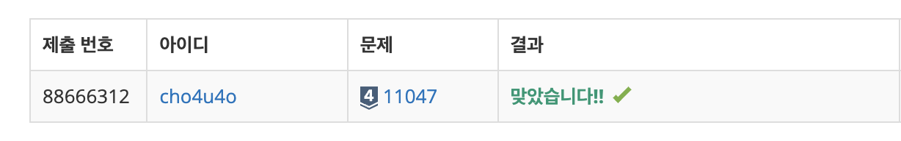

`25/01/14`

## 11047: 동전 0

```plain text
준규가 가지고 있는 동전은 총 N종류이고, 각각의 동전을 매우 많이 가지고 있다.

동전을 적절히 사용해서 그 가치의 합을 K로 만들려고 한다. 이때 필요한 동전 개수의 최솟값을 구하는 프로그램을 작성하시오.

첫째 줄에 N과 K가 주어진다. (1 ≤ N ≤ 10, 1 ≤ K ≤ 100,000,000)

둘째 줄부터 N개의 줄에 동전의 가치 Ai가 오름차순으로 주어진다. (1 ≤ Ai ≤ 1,000,000, A1 = 1, i ≥ 2인 경우에 Ai는 Ai-1의 배수)
```

## 풀이

- 무조건 가장 높은 동전 단위로 K를 많이 빼고, 더이상 나눌 수 없을 때 아래 값으로 넘겨주면 될듯합니다.
- 근데 높은단위로 일일이 빼주다가 또 시간이나 메모리 초과가 날 수 이썽서, 이진탐색을 통해서 목표의 K값보다 큰값을 제외시켜줍니다. (동전단위에서)
- 해당 과정에서 이진탐색도중 K값과 동일한 동전이 있다면 1을 출력해주며 리턴합니다.
- 그리고 남은 검색대상 동전당 목표값에서 나눠주고 나눠진값을 빼주는 작업을 반복하며 나눈몫을 결과에 더해줍니다.

## 해결

하하하 원큐

