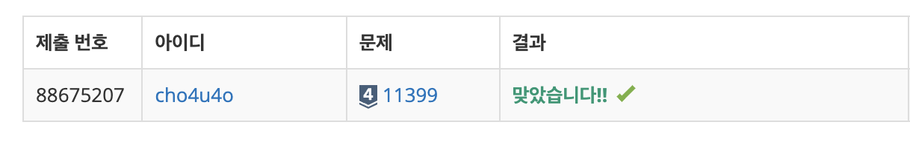

`25/01/14`

## 11399: ATM

간단하게, 첫째줄에 사람의 수 그리고 둘째 줄에 각 사람들이 돈을 뽑는 데에 걸리는 시간이 입력으로 들어옵니다. 
그리고 각 사람들이 돈을 뽑는 데 걸리는 시간은 앞사람 시간의 총합 + 자신의 시간이겠죠? 
그럼 이 모든 사람들이 돈을 뽑는 데에 가장 적게 걸리는 경우의 시간의 총합을 출력하면 됩니다.

## 풀이

- 작은 수부터 올 수 있도록 오름차순으로 시간들을 정렬해 줍니다.
- 최대한 반복문 사용을 줄이기 위해서 한번의 반복문으로 이전 값의 합과 이번 값을 더하는 로직, 그리고 이번 합을 총합에 추가하는 로직을 작성해 줬습니다.

## 해결

10분 해결 let's go

