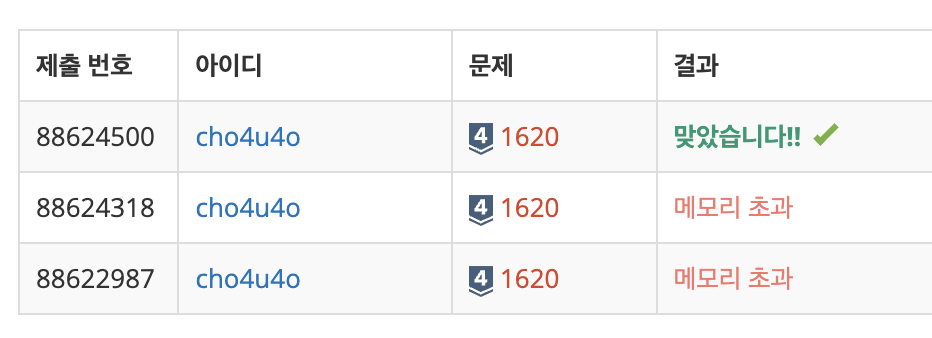

`25/01/13`

## 1620: 나는야 포켓몬 마스터 이다솜

스토리가 너무 길어서 당황했던 문제.. 하지만 문제 설명을 반말으로 해줘서 기분이 좋았어. 그럼 나도 반말으로 기록을 해야겠지?? 가랏!!

첫째 줄에는 도감에 수록되어 있는 포켓몬의 개수 N이랑 내가 맞춰야 하는 문제의 개수 M이 주어져. N과 M은 1보다 크거나 같고, 100,000보다 작거나 같은 자연수야.

둘째 줄부터 N개의 줄에 포켓몬의 번호가 1번인 포켓몬부터 N번에 해당하는 포켓몬까지 한 줄에 하나씩 입력으로 들어와. 포켓몬의 이름은 모두 영어로만 이루어져있고, 또, 음... 첫 글자만 대문자이고, 나머지 문자는 소문자로만 이루어져 있어. 아참! 일부 포켓몬은 마지막 문자만 대문자일 수도 있어. 포켓몬 이름의 최대 길이는 20, 최소 길이는 2야.

그 다음 줄부터 총 M개의 줄에 내가 맞춰야하는 문제가 입력으로 들어와.

문제가 알파벳으로만 들어오면 포켓몬 번호를 말해야 하고, 숫자로만 들어오면, 포켓몬 번호에 해당하는 문자를 출력해야해.

첫째 줄부터 차례대로 M개의 줄에 각각의 문제에 대한 답을 말해줬으면 좋겠어!!!. 입력으로 숫자가 들어왔다면 그 숫자에 해당하는 포켓몬의 이름을, 문자가 들어왔으면 그 포켓몬의 이름에 해당하는 번호를 출력하면 돼.

## 풀이

- 자바스크립트라서 오히려 어렵지 않은걸. 이 언어로 푸는게 익숙해지니 입력 처리도 간단해졌어. 바로 입력 처리 들어가고, 포켓몬을 도감에 입력해줄게.
- 숫자를 통해서 해당하는 순번에 해당하는 포켓몬을 찾는 것은 리스트만 사용해도 어렵지 않아. 하지만 포켓몬 이름이 주어지고 해당 포켓몬이 어느 순번에 위치해 있는지 찾기 위해서는, 만약 리스트를 사용한다면 `for`문을 통해 찾아야 하는데 비효율적이야.
- 따라서 맵을 사용했어. 맵은 키를 통해서 포켓몬의 인덱스를 얻을 수 있어(포켓몬 이름은 고유하니까 키로, 인덱스를 값으로 설정)
- 근데 메모리 초과가 나서 확인해보니, 숫자를 통해 포켓몬을 구할 때 맵의 키를 배열로 전환하는 과정을 계속 거쳤던 것이 문제였어.
- 따라서 기존에 입력을 처리하는 과정에서 포켓몬 이름 배열을 따로 빼놓고, question이 숫자일 때에는 배열에서 인덱스를 통해 값을 빼오도록 했어!!

## 해결

다솜이가 포켓몬 도감을 받을 수 있게 되었어!! 다솜아 화이팅!

