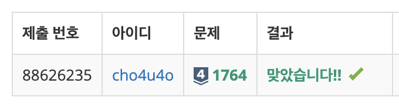

`25/01/14`

## 1764: 듣보잡

김진영이 듣도 못한 사람의 명단과, 보도 못한 사람의 명단이 주어질 때, 듣도 보도 못한 사람의 명단을 구하는 프로그램을 작성하는 문제입니다.

첫째 줄에 듣도 못한 사람의 수 N, 보도 못한 사람의 수 M이 주어지고 이어서 둘째 줄부터 N개의 줄에 걸쳐

- 듣도 못한 사람의 이름과,
- N+2째 줄부터 보도 못한 사람의 이름이(결국 듣도 못한 사람 다음에 이어진다는 뜻)

순서대로 주어집니다.

이름은 띄어쓰기 없이 알파벳 소문자로만 이루어지며, 그 길이는 20 이하입니다. N, M은 500,000 이하의 자연수입니다.

명단에는 중복이 없습니다.

## 풀이

- 입력을 분리하고, 겹치는 사람을 찾아 줄력해주면 됩니다.
- N과 M이 최대 50만이기 때문에, 조심해서 작성해야 합니다.
- 둘다 처음에 입력을 받을때 배열로 받기 때문에 그냥 그대로 처리해줬고, 그리고 두 배열 중 하나는 Map으로 만들어서 값을 찾기 편리하도록 했습니다.
- 또한 맵으로 만들어주기 전에 정렬해서 주긴 했습니다.. 조금 더 빨리 찾으라고

## 해결

원큐에 해결!!!

