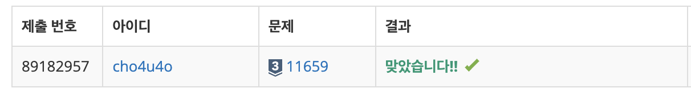

`25/01/26`

## 11659: 구간 합 구하기 4

- 문제 
  수 N개가 주어졌을 때, i번째 수부터 j번째 수까지 합을 구하는 프로그램을 작성하시오.

- 입력 
  첫째 줄에 수의 개수 N과 합을 구해야 하는 횟수 M이 주어진다. 둘째 줄에는 N개의 수가 주어진다. 수는 1,000보다 작거나 같은 자연수이다. 셋째 줄부터 M개의 줄에는 합을 구해야 하는 구간 i와 j가 주어진다.

- 출력 
  총 M개의 줄에 입력으로 주어진 i번째 수부터 j번째 수까지 합을 출력한다.

## 풀이

- 메모리도, 시간도 빡빡한 편은 아니네요..
- map에 누적합을 저장해준뒤 범위대로 빼주면 되겠습니다

## 해결

