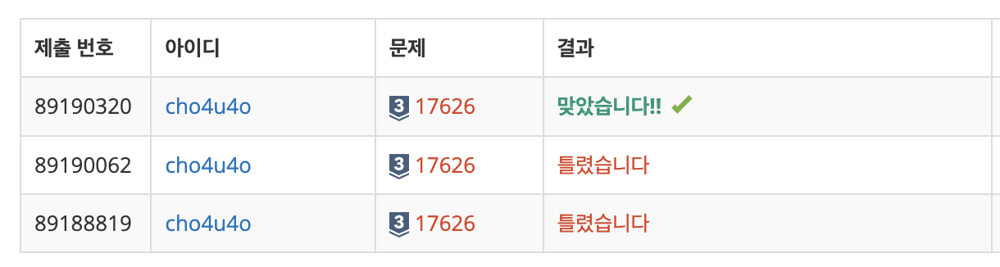

`25/01/26`

## 11727: 2×n 타일링 2

```plain text
라그랑주는 1770년에 모든 자연수는 넷 혹은 그 이하의 제곱수의 합으로 표현할 수 있다고 증명하였다. 어떤 자연수는 복수의 방법으로 표현된다. 예를 들면, 26은 5^2과 1^2의 합이다; 또한 4^2 + 3^2 + 1^2으로 표현할 수도 있다. 역사적으로 암산의 명수들에게 공통적으로 주어지는 문제가 바로 자연수를 넷 혹은 그 이하의 제곱수 합으로 나타내라는 것이었다. 1900년대 초반에 한 암산가가 15663 = 125^2 + 6^2 + 1^2 + 1^2라는 해를 구하는데 8초가 걸렸다는 보고가 있다. 좀 더 어려운 문제에 대해서는 56초가 걸렸다: 11339 = 105^2 + 15^2 + 8^2 + 5^2.

자연수 n이 주어질 때, n을 최소 개수의 제곱수 합으로 표현하는 컴퓨터 프로그램을 작성하시오.
```

## 풀이

- dp 사용하면 됩니다!
- 제곱근한 값을 빼고 남은값 디피에서 찾는 방식으로, 가장 최솟값을 찾았습니다

## 해결


