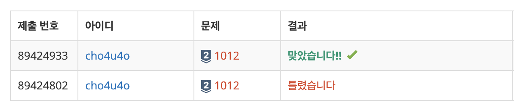

`25/02/01`

## 1012: 유기농 배추

```Plain text
이제 DFS BFS 시작이네요 ㅠㅠ
인접한 그룹이 몇개인지를 찾는 문제입니다
```

## 풀이

```Plain text
자바스크립트의 경우 입력을 받을 때 다음 줄을 받을 수가 없기 때문에 입력을 받는 부분도 까다로웠습니다. 저는 endpoint라는 변수를 통해서 이전 테스트케이스의 입력이 끝나는 index를 저장해 나가는 방식을 사용했습니다.

그리고 문제의 본론인 인접한 그룹이 몇 개인지를 찾는 방법으로는 문제에서 주어진 대로 이미 배추가 심어져 있는 칸의 상하좌우를 탐색하는 방식을 사용했습니다. 깊이 우선 탐색을 문제에 맞게 변형했습니다.

처음에는 입력을 통해 표시된 2차원 배열 모두를 순회하며 해당 칸에 배추가 심어져 있는지(값이 1인지), 그리고 방문했는지(복사 2차원 배열에서 해당 칸의 값이 0이 아닌지)를 검사한 후 만약 배추가 심어져 있는데 방문하지 않았다면 깊이 우선 탐색을 통해 상하좌우로 인접해 있으며 배추가 심어져 있는 칸에 방문했음을 표시합니다.

이렇게 되면 인접한 배추 모임이 새로 생길 때에만 깊이 우선 탐색을 진행하기 때문에, 깊이 우선 탐색이 진행될 때마다 정답으로 출력될 지렁이 수 변수를 ++해 주었습니다.
```

## 해결


저 자신도 이해하기 위해 풀이를 좀 길게 적어 봤습니다!!
