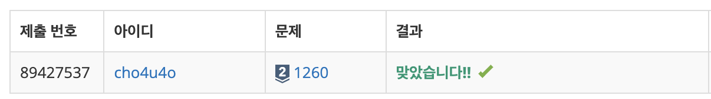
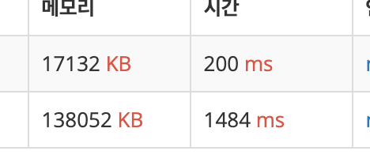

`25/02/01`

## 1260: DFS와 BFS

```Plain text
그래프를 DFS로 탐색한 결과와 BFS로 탐색한 결과를 출력하는 문제입니다.
방문할 수 있는 정점이 여러 개인 경우에는 정점 번호가 작은 것을 먼저 방문하고, 더 이상 방문할 수 있는 점이 없는 경우 종료하면 됩니다. 정점 번호는 1번부터 N번까지입니다.

첫째 줄에 정점의 개수 N(1 ≤ N ≤ 1,000), 간선의 개수 M(1 ≤ M ≤ 10,000), 탐색을 시작할 정점의 번호 V가 주어집니다.
```

## 풀이

```Plain text
자바스크립트에서 그래프를 어떤 식으로 저장해야 할 지 고민해 보았는데, Node라는 클래스를 정의하여 구현할 수 있을 것 같았습니다.

어떻게든 풀고 나서 보니까 자바스크립트에서도 연결 리스트를 구현할 수 있다는 것을 알게 되었습니다.
```

## 해결


개선된 풀이를 사용하였을 때의 시간 감소가 눈에 띄네요 ㄷㄷ

