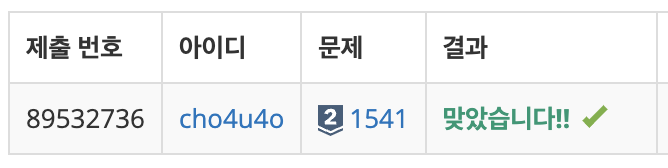

`25/02/04`

## 1541: 잃어버린 괄호

```Plain text
괄호를 적절히 쳐서 주어진 식의 값을 최소로 만드는 문제입니다.
첫째 줄에 식이 주어진다. 식은 ‘0’~‘9’, ‘+’, 그리고 ‘-’만으로 이루어져 있고, 가장 처음과 마지막 문자는 숫자이다. 그리고 연속해서 두 개 이상의 연산자가 나타나지 않고, 5자리보다 많이 연속되는 숫자는 없다. 수는 0으로 시작할 수 있다. 입력으로 주어지는 식의 길이는 50보다 작거나 같다.
```

## 풀이

```Plain text
일단 input을 통해 식을 받아와 줍니다. 식의 값을 최소로 하기 위해서는 무조건 뺄셈 기호 뒤에 있는 덧셈 연산을 묶어줘야 한다고 생각했어요. 그렇게 생각했더니 간단하게 바로 해결!
```

## 해결


