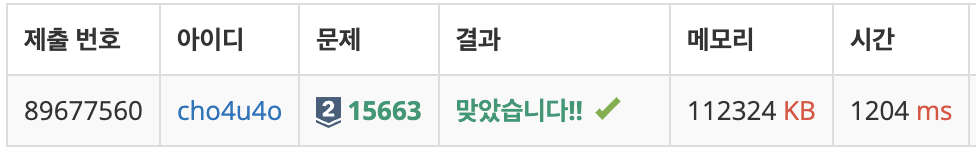
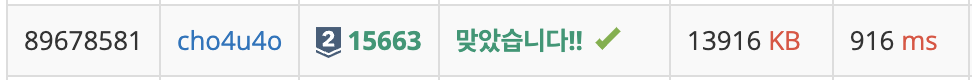

`25/02/05`

## 15663: N과 M (9)

```Plain text
N개의 자연수와 자연수 M이 주어졌을 때, 아래 조건을 만족하는 길이가 M인 수열을 모두 구하는 프로그램을 작성하는 시리즈 문제입니다. 이제는 중복되는 숫자도 있네용
```

## 풀이

```Plain text
이전에는 무조건 중복이면 걸러냈었는데, 이제는 대상 배열 내부에도 중복된 숫자가 주어지다 보니 이 경우는 허용을 해 주어야 했습니다. 고민을 많이 했는데, 생각해보니 대상 배열 내부에서 주어진 숫자의 수보다 많으면 정답 케이스에서 제외해주도록 하면 되겠더라구요.
```

## 해결



```Plain text
위 정답은 시간과 메모리를 고려를 하지 않았는데, 중복처리 등에 있어서 map을 사용하면 시간과 메모리를 대폭 절약할 수 있을 것 같아서 코드를 개선했습니다.
```



```Plain text
개선한 답안 코드는, 중복된 요소의 수를 map에 저장했으며 사용할 때마다 요소의 수를 map에서도 줄이며 동작 과정에서 중복을 방지했습니다.(같은 수 추적 방지 ex.1추적 후 요소에 더 1이 없는데도 1추적) 또한 prevNum 값을 통해 이전 재귀 단계에서 사용한 숫자를 기억하여 같은 깊이에서의 같은 수 추적을 방지하여 중복을 방지했습니다. (1, 1 존재시 재추적 방지 ex.1경우수 모두 추적 후 또 1추적 방지)
```

```pgsql
temp = []  (백트래킹 시작)
 ├── 1 선택 → temp = [1]
 │    ├── 1 선택 → temp = [1, 1] (출력)
 │    ├── 2 선택 → temp = [1, 2] (출력)
 ├── 1 선택 → temp = [1] (중복 발생!!)
 │    ├── 1 선택 → temp = [1, 1] (중복된 수열!!)
 │    ├── 2 선택 → temp = [1, 2] (중복된 수열!!)
 ├── 2 선택 → temp = [2]
      ├── 1 선택 → temp = [2, 1] (출력)
      ├── 2 선택 → temp = [2, 2] (출력)
```

```pgsql
temp = []  (백트래킹 시작)
 ├── 1 선택 → temp = [1]  (prevNum = 1)
 │    ├── 1 선택 → temp = [1, 1] (출력)
 │    ├── 2 선택 → temp = [1, 2] (출력)
 ├── (1 선택 불가)  ❌ prevNum = 1, nums[i] = 1 (중복 방지됨)
 ├── 2 선택 → temp = [2] (prevNum = 2)
      ├── 1 선택 → temp = [2, 1] (출력)
      ├── 2 선택 → temp = [2, 2] (출력)
```
