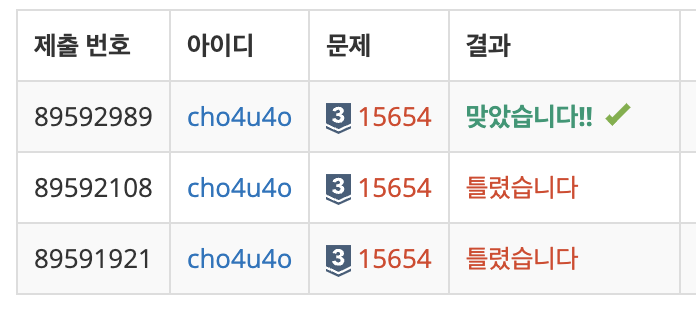

`25/02/05`

## 15654: N과 M (5)

```Plain text
자연수 N과 M이 주어졌을 때, N개의 수 중 길이가 M인 수열을 모두 구하는 문제입니다.
```

## 풀이

```Plain text
이전 문제에서, 골라야 하는 수도 정해주는 문제입니다. 그럼 이제는 받은 수를 정렬해서 사용해주면 되겠죠. 또한 이번 문제는 중복도 상관 없으며 모든 경우를 구하면 됩니다. 따라서 백트래킹을 할 때 이전에 받은 수부터 하는 것이 아니라 모두 처음부터 백트래킹을 돌립니다. 하나의 수가 여러 개 있는 경우만 빼고 answer에 push해주면 됩니다.
```

## 해결


