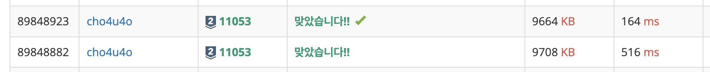

`25/02/10`

## 11053: 가장 긴 증가하는 부분 수열

```Plain text
주어진 배열에서 가장 긴 증가하는 부분 수열의 길이를 출력하면 된다.
```

## 풀이

```Plain text
dp 통해서 인덱스를 올리면서, 현재 인덱스의 값보다 작은 값의 값들을 대상으로 그 값의 수(수열 수) + 1과 현재 값의 수열 수를 비교해서 더 큰 값을 현재 값의 수열 수로 갱신해 주었습니다. 처음에는 중복제거후 정렬해서 길이를 출력하는 건 줄 알았지만 그럴 리가 없었습니다. 이 문제에서 포인트는 현재 처리 상황에서 전 인덱스 값들을 훑어서 상황을 갱신하는 것이라고 생각했습니다. 다들 말한 것처럼 점화식 찾기 어렵네요
```

## 해결


