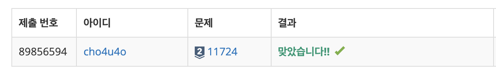

`25/02/10`

## 11724: 연결요소의 개수

```Plain text
방향 없는 그래프가 주어졌을 때, 연결 요소 (Connected Component)의 개수 구하기.
```

## 풀이

```Plain text
이전에 공부한 DFS 토대로 적용! 방문하지 않은 노드 대상 dfs 적용하고 갈 노드가 없으면(연결 끝) 다른 연결 탐색! 이 횟수를 카운트해서 출력합니다.
```

## 해결


