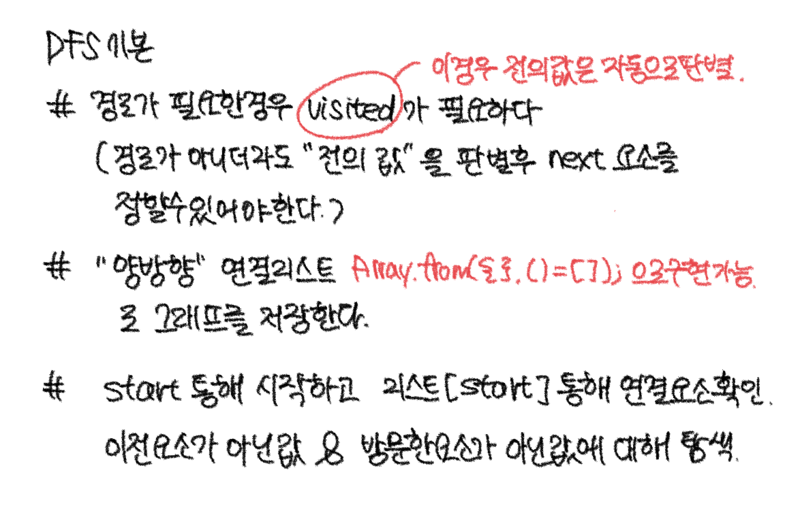
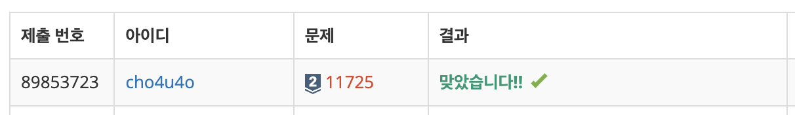

`25/02/10`

## 11725: 트리의 부모 찾기

```Plain text
그래프가 주어지고 2번 노드부터 각 노드의 부모를 출력하면 된다.
```

## 풀이

```Plain text
DFS 적용한다고 생각을 복잡하게 했다. 그냥 DFS로 탐색하되 간단하게 이전에 방문한 것이 아님을 체크하며 요소의 부모만 체크해주면 되는 것이었음.

```



## 해결


