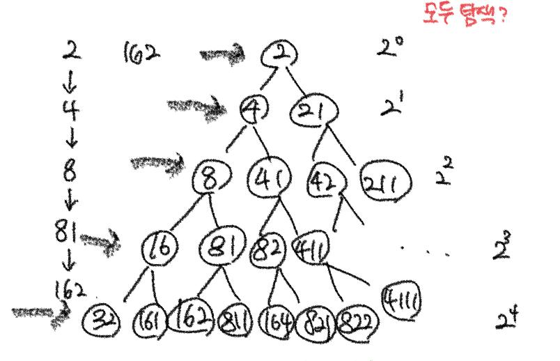
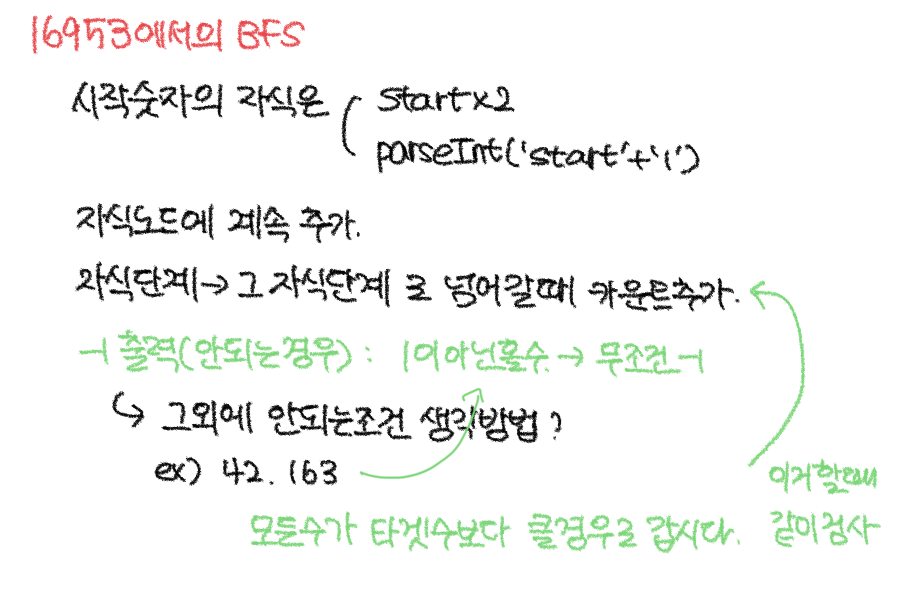
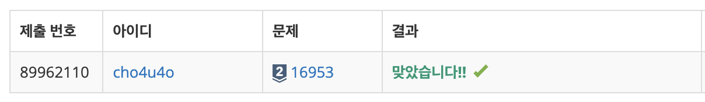

`25/02/12`

## 16953: A -> B

```Plain text
정수 A를 B로 바꾸려고 한다. 가능한 연산이 다음과 같이 두 가지일 때,
2 곱하기, 1을 수의 가장 오른쪽에 추가하기
A를 B로 바꾸는데 필요한 연산의 최솟값을 구하면 됩니다.

첫째 줄에 A, B (1 ≤ A < B ≤ 109)가 주어지고, A를 B로 바꾸는데 필요한 연산의 최솟값에 1을 더한 값을 출력합니다. 만들 수 없는 경우에는 -1을 출력합니다
```

## 풀이



```Plain text
위 그림과 같은 그래프 구조를 생각했습니다. 그리고 아래와 같이 BFS 활용해 해결했습니다.
```



## 해결


