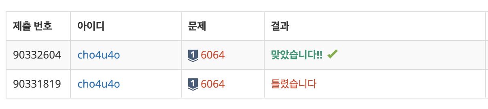

`25/02/20`

## 6064: 카잉 달력

<a href="https://www.acmicpc.net/problem/6064">백준 6064</a>

## 풀이

```Plain text
이 문제를 풀면서 처음에는 크게 두 가지 방법을 생각했습니다.

1안의 경우 최소공배수(모든 년도)만큼을 나열하고 구간별로 그루핑을 진행하는 방법이었습니다. 이 방법은 예를 들어 M이 10이고 N이 12인 경우, 60가지 상황을 나열하되 이차원 배열을 사용하자는 생각이었습니다.

2안의 경우 M과 N의 차이만큼 같은 M 숫자에 매핑되는 N의 숫자가 줄어드는 것에 기반한 방법입니다. M과 N의 차이를 계산하고 이를 토대로 년도를 계산하는 방법이었습니다. 하지만 해당 방법의 경우 M과 N의 차이에 기반한 만큼, M>N인 경우와 N>M인 경우에 대응하지 못했습니다.

이후 검색의 힘을 빌려, 최적화된 풀이를 찾고자 했습니다.

x에 해당하는 년도부터 시작합니다. (초기에는 x 년도 === 실제 년도) 그리고 M을 더하면 다시 x로 돌아오게 되는 점에 기반해서, 실제 년도에 M을 더해주며 해당 년도에서 N의 나머지를 구합니다. 나머지가 y와 같다면 값이 존재하므로 년도를 출력하고, M을 계속 더해 최대 년도(최소공배수)가 넘어가면 -1을 출력하게 됩니다. 간단하게 생각하면 되는 문제였습니다

가장 곤란했던 부분은 나머지를 구하는 부분이었는데요.. 나머지를 구할 때 원래는 0에서 N-1까지의 나머지를 출력하기 때문에 1부터 N까지의 나머지를 사용하는 해당 문제에서는 추가적인 연산이 들어가야 했습니다. 그냥 나머지에 1을 더해버리면 년도를 왜곡하는 것이 되기 때문에, 년도에서 1을 빼서 구한 나머지에 다시 1을 더해주는 방법을 사용한 것입니다
```

## 해결



```Plain text
처음에 문제를 분석할 때에 너무 문제가 간단하지 않다고 생각해서 지레 겁을 먹었던 것 같습니다. 또 유클리드 호계법을 사용해 최대공약수 계산을 구현했는데, 이 부분도 쉽지 않았습니다
```
