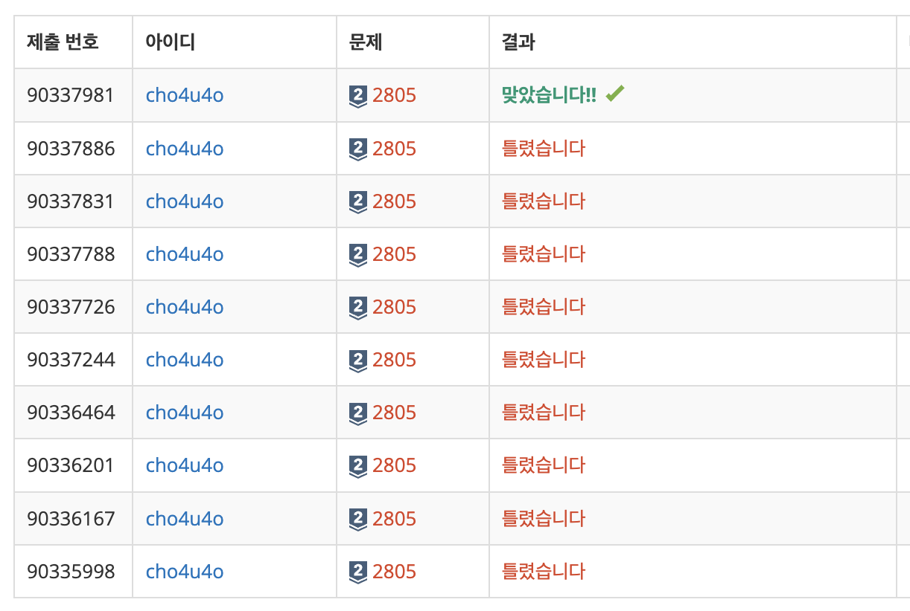

`25/02/20`

## 2805: 나무 자르기

<a href="https://www.acmicpc.net/problem/2805">백준 2805</a>

## 풀이

```Plain text
M의 최댓값이 무려 20억이고 N의 최댓값이 100만인 문제입니다. 그리디를 풀고 싶어서 골랐는데 그리디로 풀어버리면 안된다고 강하게 이야기하고 있는 문제입니다.

정말 나무를 베듯이 풀고 싶다는 마음이 들었습니다. 나무들(N)을 정렬하면.. O(nlogn)정도 시간이 든다고 생각하면 600만회 연산을 하겠네요
그 뒤에는 이진 탐색을 하듯이 찾아 가면서 나무를 잘라 주면 될 것 같다고 생각했습니다. O(logn)이니까 시간도 괜찮을 것 같고
```

## 해결

ㅋㅋ!


```
그래도 솔직히 이진 탐색을 생각해 낸 제가 너무 대단합니다. ㅋㅋㅋ
이진탐색 관련해서 범위설정하는 데에 시간을 좀 썼네요. 또 마지막에는 reduce 함수와 max를 사용해서 filter함수를 대신했는데 이게 정말 좋았던 것 같습니다
```
