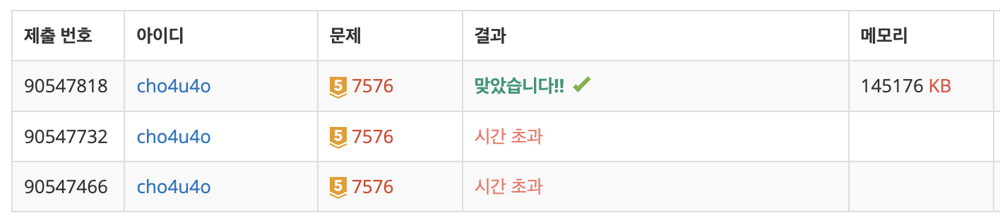

`25/02/25`

## 7576: 토마토

<a href="https://www.acmicpc.net/problem/7576">백준 7576</a>

## 풀이

```Plain text
어렵지만 빨간 토마토를 생각하면서 꾹 참고 풀었습니다.

토마토가 들어있는 보드의 입력을 받고, 익은 토마토가 어디에 있는지 파악합니다.
초기에 익은 토마토가 있으면 x위치, y위치, 날짜를 큐에 저장합니다.
큐에서 하나씩 꺼내면서 큐에 있었던 토마토의 상하좌우를 살피고
상하좌우, 범위 넘치지 않음 조건에 부합하는 토마토가 있다면
위치와 날짜(현재 날짜 + 1)를 저장한 객체를 큐에 저장합니다.
해당 행위를 큐가 끝날 때까지 반복해 주면 됩니다.

자바스크립트에서 시간을 줄이기 위해서,
큐 관련 연산을 좌에서 꺼내는 방식이 아닌 인덱스를 올려주는 방식을 사용했습니다.
```

## 해결



```Plain text
시간 초과 관련해서 조금 고려할 게 있지만
그래도 골드 치고 완전 어렵지는 않다고 생각합니다.
추천!
```
