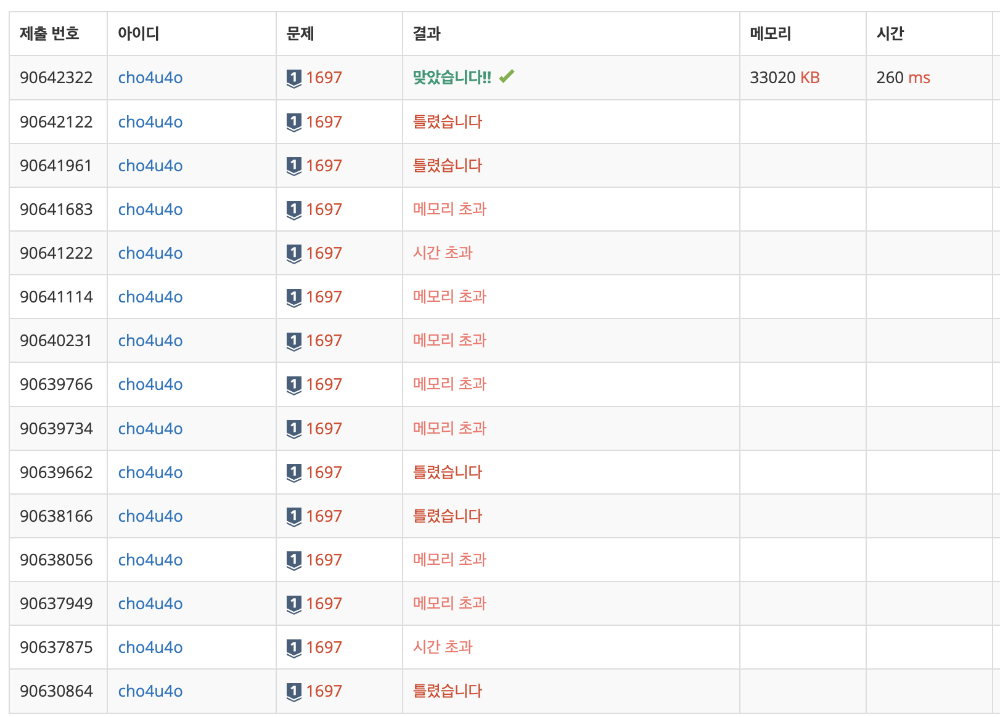

`25/02/27`

## 1697: 숨바꼭질

<a href="https://www.acmicpc.net/problem/1697">백준 1697</a>

## 풀이

```Plain text
예전에 특정 값을 가지고 경우의 수를 따져서
그래프를 만들고
그래프에서 너비 우선 탐색을 통해
답에 도달했던 문제가 있었는데
딱 그런 문제 같습니다.

이 문제는 시간, 메모리가 조금 엄격해서
고민을 많이 했는데
queue 사용시 shift 쓰지 않고
인덱스 올리기 방법을 사용했구요

원래는 기하급수적으로 커다란 값이면 더블링 통해서
최대한 접근 후 값을 찾고자 했었는데
이게 반례가 있었나 봐요
자꾸 틀려서
상한선을 지정을 해주고 (타겟보다 2배이상크면 탐색X)
하던대로 BFS 해줬습니다.
이번 BFS는 접근 잘 한 것 같은데
더블링 관련해서는 좀 아쉬웠어요~..
```

## 해결



```Plain text
ㅠㅠ...
한없이 초라해지네요
그래도 화이팅
```
